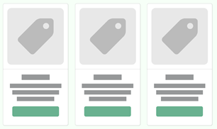

# Eagle-Market

Este proyecto es un ecommerce creado con React basado en la API desarrollada en mi repositorio [ecommerce-json-server](https://github.com/IV4NGM/ecommerce-json-server "ecommerce-json-server"). Se encuentra desplegada en la dirección web [eagle-market.netlify.app](eagle-market.netlify.app "eagle-market.netlify.app").

### Características principales

* Se puede hacer un registro de usuarios nuevos, seleccionando uno y solo uno de los roles: **Cliente** y **Administrador**.
* Los usuarios tipo **Cliente** pueden comprar productos, añadirlos a su carrito y ver el historial de compras.
* Los usuarios tipo **Administrador** pueden hacer todo lo que hace un usuario tipo **Cliente**, así como crear nuevos productos y editar o eliminar los ya existentes.
* Los usuarios que no han iniciado sesión pueden ver productos en la página prinicipal [Home](#home "Home") y hacer uso de la búsqueda avanzada en la página [Search](#search "Search"). Sin embargo, al intentar comprar un producto o agregarlo al carrito se le redirigirá automáticamente a la página de [Iniciar sesión](#login "Login").
* Cada llamada fallida a la API es mostrada con un *Modal*. Algunas llamadas muestran, mientras se espera su resolución, una imagen de carga, la cual desaparece tras terminar. Ejemplos de esto se pueden encontrar en las páginas de [Iniciar sesión](#login "Login"), [Registro](#signup "Signup"), [Historial de compras](#myOrders "MyOrders") y [Detalles de compra](#orderDetails "OrderDetails").
* Cada página puede mostrar un botón en la esquina inferior derecha con una flecha hacia arriba ([Botón Scroll to Top](#scrollToTop "ScrollToTop")). Dicho botón solo aparece cuando se ha desplazado hacia abajo de la página y desaparece de nuevo cuando se está hasta arriba. Al darle clic se dirige hasta arriba de la página.

#### Características técnicas

* El diseño del sitio es completamente *responsive*.
* Se hace uso de localStorage para guardar los datos de inicio de sesión.
* Se utiliza React Context para actualizar el [carrito de compras](#carrito "Carrito"), manejar los datos de inicio de sesión y el historial de compras.
* Se hace uso de React Router Dom para manejar las rutas. A continuación se enlistan las principales propiedades y funcionalidades de cada ruta y algunos componentes especiales.

#### Rutas

##### Home

Al inicio de esta página hay un saludo personalizado con el nombre del usuario que ha iniciado sesión (si es que hay uno), o un mensaje general para usuarios no registrados.

Muestra las distintas tarjetas de productos agrupados en categorías, cada una con un *carousel*. Después de los componentes ilustrativos, se muestra un primer *carousel* generado automáticamente con las categorías que contienen al menos un producto.

Posteriormente se muestra una sección de categorías principales, que corresponde a aquellas que contienen al menos 7 productos, ordenadas de acuerdo a la cantidad de elementos que poseen. Esta sección se va actualizando automáticamente conforme se agregan nuevos productos, y cada categoría muestra sus productos en un *carousel*.

Por último, se muestran todas las categorías no vacías ordenadas alfabéticamente, cada una mostrando sus productos dentro de un *carousel*.

Al darle clic al nombre de cada categoría (tanto en el *carousel* de categorías como en los demás elementos *carousel* de productos clasificados por categoría) se redirige a la página de [Búsqueda avanzada](#search "Search") mostrando únicamente los productos de la categoría seleccionada.

Todos los elementos *carousel* mencionados anteriormente son *responsive*.

Mientras no se cargan todos los productos de la API se muestran 3 [Placeholders de tarjetas de productos](#placeholders "Placeholders").

##### Search

Esta página corresponde a la Búsqueda avanzada. Originalmente se muestran todos los productos. Contiene un filtro que se compone de búsqueda por texto, elementos tipo *checkbox* para seleccionar categorías y un deslizador doble para clasificar por precio.

En la búsqueda por texto se pueden encontrar productos por nombre, marca o categoría.

Los elementos tipo *checkbox* sirven para seleccionar las categorías de las cuales se deberán mostrar los productos. Estos elementos se generan automáticamente de tal manera que solo se muestren categorías no vacías. Se pueden seleccionar una o más categorías, o todas ellas.

El deslizador doble para filtrar por precios permite seleccionar el rango de precios al que deben pertenecer los productos mostrados.

Un producto se mostrará en los resultados si y solo si cumple las siguientes tres condiciones simultáneamente:

1. Su nombre, marca o categoría contiene al texto ingresado en la búsqueda por texto.
2. Pertenece a alguna de las categorías seleccionadas.
3. Su precio es mayor o igual al número indicado por el deslizador de la izquierda, menor o igual al número indicado por el deslizador de la derecha, y este último deslizador no es 1000+; o bien, su precio es mayor o igual al número indicado por el deslizador de la izquierda y el deslizador de la derecha indica 1000+.

La última condición puede interpretarse más fácilmente considerando que el valor 1000+ seleccionado por el segundo deslizador indica que no hay una cota superior para el precio del producto.

En caso de no haber resultados, se muestra un mensaje especial sin arrojar algún error.

Los filtros se aplican inmediatamente, y existe una opción de restablecerlos por medio de un botón.

Mientras no se cargan todos los productos de la API se muestran 3 [Placeholders de tarjetas de productos](#placeholders "Placeholders").

##### Login

Esta página sirve para hacer inicio de sesión a una cuenta ya existente. Los campos de *Correo electrónico* y *Contraseña* deben llenarse para poder intentar iniciar sesión, y estos se validan con yup, mostrando mensajes de estado de qué datos faltan por llenar cuando se hace el primer intento de *submit*.

En caso de que el conjunto de correo electrónico y contraseña proporcionados no se encuentre en la base de datos, se muestra un texto de error, y si existe algún otro problema con la llamada a la API se muestra un *Modal*.

En lo que se espera la respuesta de la API se muestra una imagen de carga.

Si los datos ingresados son correctos, se redirige automáticamente a la página de [Home](#home "Home").

Además, hay un botón que permite ir a la página de [Registro](#signup "Signup") para crear una cuenta nueva.

##### Signup

La página de registro permite crear nuevos usuarios. Sus datos son validados con yup. Se debe seleccionar uno y solo un rol para la cuenta nueva, de entre **Cliente** y **Administrador**. La contraseña debe tener un número, una letra mayúscula, una letra minúscula y un caracter especial. Posee un campo en donde se debe repetir la contraseña para confirmarla.

Si el correo electrónico ya se encuentra registrado se muetra un texto de error, y si existe algún otro problema con la llamada a la API se muestra un *Modal*.

En lo que se espera la respuesta de la API se muestra una imagen de carga.

Si los datos ingresados son aceptados se muestra un *Modal* de confirmación y se indica que se debe iniciar sesión para continuar. Sin importar la acción que haga el usuario con este modal (aceptarlo, cerrarlo o dar clic fuera de él), se redirige automáticamente a la página de [Iniciar sesión](#login "Login").

Además, hay un botón que permite ir a la página de [Iniciar sesión](#login "Login") si se quiere usar una cuenta ya existente.

##### ProductDetails

Esta página permite ver los detalles de un producto: su nombre, imagen, precio, marca, categoría, SKU y descripción, además de agregarlo al carrito o comprarlo inmediatamente.

La descripción se muestra con los saltos de línea ingresados al crear el producto. La marca, categoría y SKU (en caso de existir) se presentan en una tabla.

Se puede seleccionar la cantidad de artículos de este mismo producto que se quieren ya sea agregar al carrito o comprar ahora. Para conocer más detalles sobre estas dos acciones véase [Checkout](#checkout "Chekout").

Si se es administrador, existen dos botones adicionales a los demás tipos de usuario: uno para editar el producto y otro para eliminarlo. El botón de editar producto redirige a una página especial para ello, y el de eliminarlo muestra un *Modal* de confirmación para realizarlo. Para más detalles véase [Funcionalidades especiales de Administrador](#administrador "Administrador").

Hay una imagen por defecto para los productos que no tienen información de alguna imagen en específico o si esta información es incorrecta (por ejemplo, si el link de la imagen que debería estar ahí no sirve).

##### Checkout

Esta página permite modificar y eliminar elementos que se desean comprar, y posteriormente hacer dicha transacción en caso de que el usuario lo indique. Posee dos funcionalidades principales:

* **Comprar ahora:** Corresponde a un único producto que se puede comprar independientemente de los demás que se tengan agregados en el carrito. Cuando el usuario selecciona esta opción, se crea este apartado independiente al carrito, en donde se puede comprar el producto sin afectar a los elementos que pertenezcan al carrito, o agregarlo al carrito para comprar más tarde. En caso de que el producto ya se encuentre en el carrito y se seleccione *Agregar al carrito*, se sumarán las respectivas cantidades y aparecerá una única tarjeta en el carrito correspondiente a este producto con el resultado de dicha suma.
* **Carrito:** En esta sección se muestra un conjunto de productos listos para comprar al dar clic en el botón *Comprar carrito*. Cuando un producto que ya se encontraba en el carrito vuelve a añadirse, se suman las cantidades correspondientes, de tal manera que siempre aparezca una única tarjeta por producto.

Las tarjetas de los productos en estas secciones contienen botones que permiten modificar la cantidad elegida de cada artículo, restando o sumando 1, respecitvamente. Cuando la cantidad es igual a 1 y se da clic en el botón de restar, aparece un *Modal* de confirmación para eliminarlo del carrito. Además, independientemente de la cantidad, hay un botón en forma de X que permite eliminar el artículo del carrito, mostrando un *Modal* para confirmarlo.

Al dar clic en cada tarjeta de un producto se dirige a [Detalles del producto](#productDetails "ProductDetails").

Al dar clic en algún botón para comprar, aparece un modal de confirmación, y en caso de que se acepte, se hace una llamada a la API para registrar dicha compra, mostrando una imagen de carga mientras se espera a la respuesta. Posteriormente a esto aparece otro *Modal*, diciendo si la compra pudo o no realizarse correctamente.

Si no hay productos ni en el carrito ni en comprar ahora aparece una imagen de fondo y se sugiere ir a Inicio para comprar.

##### MyOrders

En Mis Compras aparece el historial de compras realizadas por el usuario. Este presenta una imagen de carga mientras se hace un llamado a la API para recuperar el historial del usuario, y muestra un *Modal* si existe algún error en este llamado.

Las compras aparecen mostrando su ID, fecha y hora de compra, cantidad de productos, precio total y cuáles son los artículos comprados, incluyendo sus cantidades individuales.

Al dar clic en cada compra se redirige a [Detalles de la compra](#orderDetails "OrderDetails").

Al dar clic en cada tarjeta de un producto se dirige a [Detalles del producto](#productDetails "ProductDetails").

Si el usuario no ha realizado alguna compra se muestra una imagen de fondo y se sugiere ir a Inicio para comprar.

##### OrderDetails

En esta página se muestra el detalle individual de la compra seleccionada, mostrando en un contenedor su ID, fecha y hora de compra, cantidad de productos, precio total y cuáles son los artículos comprados, incluyendo sus cantidades individuales. En otro contenedor se muestra un resumen que solo incluye su ID, fecha y hora de compra, cantidad de productos y precio total.

Al dar clic en cada tarjeta de un producto se dirige a [Detalles del producto](#productDetails "ProductDetails").

Este presenta una imagen de carga mientras se hace un llamado a la API para recuperar el historial del usuario, y muestra un *Modal* si existe algún error en este llamado.

Por otro lado, si la llamada a la API es correcta y la compra no se encuentra, aparece un mensaje que dice que no se tiene registro de dicha compra, e invita ir a Inicio para seguir comprando.

##### NotFound

Esta es la página por defecto cuando se introduce una ruta que no se tiene registrada, mostrando una imagen que sugiere ir a Inicio para seguir comprando.

#### Componentes principales

##### Navbar

La Navbar tiene un diseño totalmente *responsive* adaptándose a distintos tipos de pantalla. Muestra botones de Registrarse e Iniciar Sesión cuando no hay un usuario con una sesión activa, y otro botón que dice el nombre del usuario en caso contrario. Al dar clic en este último se despliega un menú con la información de la cuenta del usuario activo: su nombre, correo electrónico, y una insignia en caso de que sea administrador. Además, aparecen botones para [Ver carrito](#checkout "Checkout"), ir al [Historial de compras](#myOrders "MyOrders") y Cerrar Sesión. Si se es administrador también se incluye un botón para Crear un producto.

En el tamaño de pantalla más chica desaparece la barra de búsqueda y se sustituye únicamente por una lupa, la cual al darle clic redirige a [Búsqueda avanzada](#search "Search"). En los otros tamaños en donde sí hay barra de búsqueda, al dar enter o darle clic en la lupa redirige a [Búsqueda avanzada](#search "Search") colocando en el texto de búsqueda el que se incluyó en esta barra antes de darle clic.

##### Footer

El Footer incluye los datos de la página y mi correo electrónico de contacto: [ivangm_01@hotmail.com](mailto:ivangm_01@hotmail.com "mailto:ivangm_01@hotmail.com"). Su diseño es *responsive* y para ciertos tamaños de pantalla únicamente aparecen los datos de la página.

##### Tarjetas de productos

Muestran la imagen del producto, el nombre, la marca y un botón que sirve para ver detalles. Al darle clic a cada tarjeta redirige a [Detalles del producto](#productDetails "ProductDetails"). El nombre del producto tiene un límite máximo de 3 líneas, y la marca de 1. En caso de que estos límites se excedan, se muestran tres puntos suspensivos (...), evitando *overflow*.

Hay una imagen por defecto para los productos que no tienen información de alguna imagen en específico o si esta información es incorrecta (por ejemplo, si el link de la imagen que debería estar ahí no sirve).

Si se es administrador se muestra un pequeño lápiz en la esquina superior izquierda de cada tarjeta, que al darle clic redirige a una página para editar dicho producto. Para más detalles véase [Funcionalidades especiales de Administrador](Administrador "Administrador").

###### Placeholders

Mientras se realizan las llamadas a la API para obtener información de todos los productos disponibles, no se muestra una imagen de carga, sino que se muestran placeholders del mismo formato de las tarjetas de productos. Estos se ven de la siguiente manera:

##### Carrito

Este componente es un ícono de un carrito que aparece junto con un número que indica cuántos elementos hay en el carrito, utilizando React Context.

##### ScrollToTop

Este es un botón con una flecha hacia arriba que aparece en la esquina inferior derecha de la pantalla. Dicho botón solo se muetrsa cuando se ha desplazado hacia abajo de la página en la que se encuentra, y desaparece de nuevo cuando se está hasta arriba. Al darle clic se dirige hasta arriba de la página actual.

#### Categorías de productos

Cada producto existente o cada producto que se registra/edita debe pertenecer a una y solo una de las siguientes categorías:

| Automóviles  | Bebés   | Belleza      | Computadoras | Deportes   | Despensa |
| ------------- | -------- | ------------ | ------------ | ---------- | -------- |
| Electrónicos | Exterior | Herramientas | Hogar        | Industrial | Jardín  |
| Joyería      | Juegos   | Juguetes     | Libros       | Música    | Niños   |
| Películas    | Ropa     | Salud        | Zapatos      | Otros      |          |

#### Administrador

A continuación veremos las Funcionalidades especiales de un usuario tipo **Administrador**.

##### Crear un producto

La opción de crear un producto es mediante una página que a la que solo tienen acceso los administradores. Esta contiene un formulario que pide ingresar los datos del producto: Nombre, marca, precio (con 2 decimales, mayor o igual a 1), categoría, una descripción (que puede tener saltos de línea), un SKU y una imagen, la cual se puede ingresar desde el dispositivo o por medio de una URL.

El SKU y la imagen son opcionales, y los otros campos son obligatorios. Al colocar una imagen por URL o desde el dispositivo, se muestra una vista previa de cómo se verá en las tarjetas de productos. Hay una imagen por defecto si es que no se puede cargar la imagen o el URL de la misma no funciona.

Al dar clic en el botón Crear producto se hace una validación con yup de los campos obligatorios anteriormente mencionados, y en caso de que todo sea correcto se hace una llamada a la API. Mientras se espera la respuesta se muestra una imagen de carga, y posteriomente aparece un *Modal* indicando si el registro fue exitoso o no.

##### Editar un producto

Cuando se desea editar a un producto se lleva a una página especial con un formulario igual al de Crear un producto, cuyos campos están llenos por defecto con la información del producto, la cual es recuperada por una llamada a la API. Si no se encuentra el producto al que se hace referencia se muestra un *Modal*, y sin importar la acción realizada redirige a la página de Inicio.

Existe un botón de Descartar cambios, otro de Modificar producto y otro de Eliminar producto. El de Descartar cambios muestra un *Modal* para confirmar si se desea salir de la página. El de Modificar producto hace una llamada a la API y muestra una imagen de carga, para posteriormente presentar en un *Modal* confirmando si se pudo o no realizar la acción. El comportamiento de Eliminar un producto se describe a continuación.

##### Eliminar un producto

Cuando se da clic en eliminar un producto se hace una llamada a la API y se muestra una imagen de carga, para posteriormente presentar en un *Modal* confirmando si se pudo o no realizar la acción.

Al eliminar un producto este se elimina también del carrito y de Comprar ahora si se encuentra en alguna de esas secciones.

## Mis datos de contacto

Para cualquier comentario puedes mandarme un correo electrónico a: [ivangm_01@hotmail.com](mailto:ivangm_01@hotmail.com "mailto:ivangm_01@hotmail.com").
